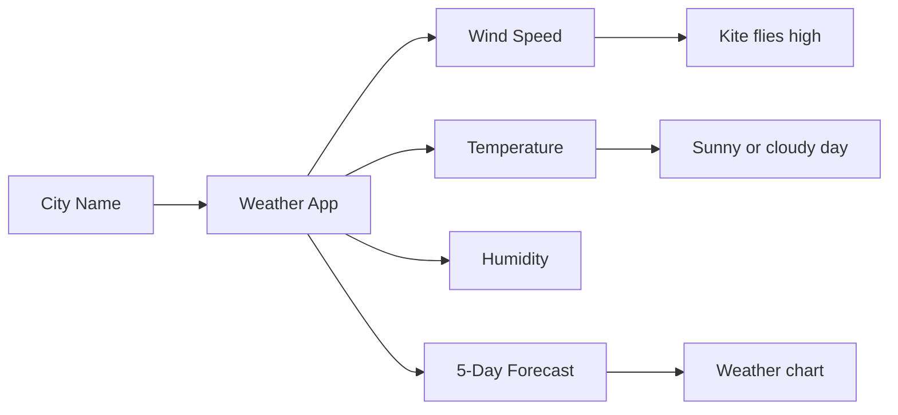

# The Kite Weather Adventure

## Chapter 1: A Windy Morning

Once upon a time, a little kid named Sam woke up and looked outside.

The sky was bright, the clouds were floating, and the wind was gently moving the leaves.

"I wonder what the weather is like today," Sam said.

Then Sam opened a magic app called [Window Title]

Visual Studio Code


[Content]

The extension 'GitHub Copilot for Azure' wants to sign in using Microsoft.


[Allow] [Cancel]the Weather Adventure App.

With just a few taps, the app told him:

- how warm it was,
- how fast the wind was blowing,
- how humid the air felt,
- and what the weather would be like for the next five days.

This app is like a friendly weather helper that lives inside a computer.

---

## Chapter 2: What the App Does

The app helps us understand the sky like a smart friend.

It can:

1. Ask for a city name,
2. Look up the weather,
3. Show the temperature,
4. Show the wind speed,
5. Show the next 5 days of weather,
6. Make a small chart so we can see the trend.

So when we type a city like London or New York, the app goes on a little adventure to find the weather.

---

## Chapter 3: The Kite Story

Imagine a kite flying high in the sky.

The kite loves wind.

If the wind is gentle, the kite moves slowly.

If the wind is strong, the kite flies high and happy.

The weather app shows the wind speed so we know if the kite can fly, dance, or rest.

### Wind Speed Guide

- 0 to 10 km/h: the kite is sleepy
- 10 to 20 km/h: the kite starts to wiggle
- 20 to 30 km/h: the kite flies happily
- 30+ km/h: the kite is very excited and strong

That is why wind speed is important.

---

## Chapter 4: The Kite Diagram

Here is a simple picture of the magic weather idea:



And here is a kite picture with the wind:

```text
           ~~~ Wind 18 km/h ~~~
                 \      __
                  \   _/  \
                   \_/     \
                     \  Kite  \
                      `-.____.-'
                          /|\
                         / | \

                 The kite is happily flying!
```

This means the wind is strong enough to help the kite move up into the sky.

---

## Chapter 5: How the Weather App Works

The app is like a little weather detective.

It does this:

- Looks up the place you type,
- Finds the weather data,
- Reads the current temperature,
- Reads the wind speed,
- Reads the weather code,
- Shows the next 5 days on a chart.

Then it turns all that information into a friendly dashboard.

---

## Chapter 6: What You See in the App

When you open the app, you can see:

- the city name,
- the weather condition,
- the temperature,
- the feels-like temperature,
- the humidity,
- the wind speed,
- a 5-day forecast.

It is like looking outside through a smart window.

---

## Chapter 7: Why This App Is Fun

This app is fun because it feels like a weather adventure.

It helps us answer questions like:

- Is the sky sunny?
- Is it cold or warm?
- Is the wind trying to lift a kite?
- Will it rain soon?
- What will the weather be like in the next few days?

A weather app is like having a tiny weather teacher in your pocket.

---

## Chapter 8: Ready to Fly?

If you want to run the app on your computer:

1. Open a terminal.
2. Go to the project folder.
3. Activate the virtual environment.
4. Run the Streamlit app.

Example:

```bash
.venv\Scripts\activate
streamlit run streamlit_app.py
```

Then open the local website in your browser.

---

## The Happy Ending

And so the kite danced in the sky while the weather app told everyone:

"The wind is moving, the air is smiling, and the day is full of adventure."

The end.

---

## Quick Summary

This project is a simple weather dashboard built with Python and Streamlit.

It tells us:

- the current weather,
- wind speed,
- temperature,
- humidity,
- and 5-day forecast details.

It is simple, colorful, and easy to understand for kids.
